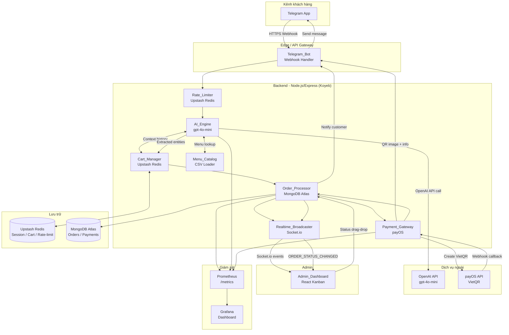
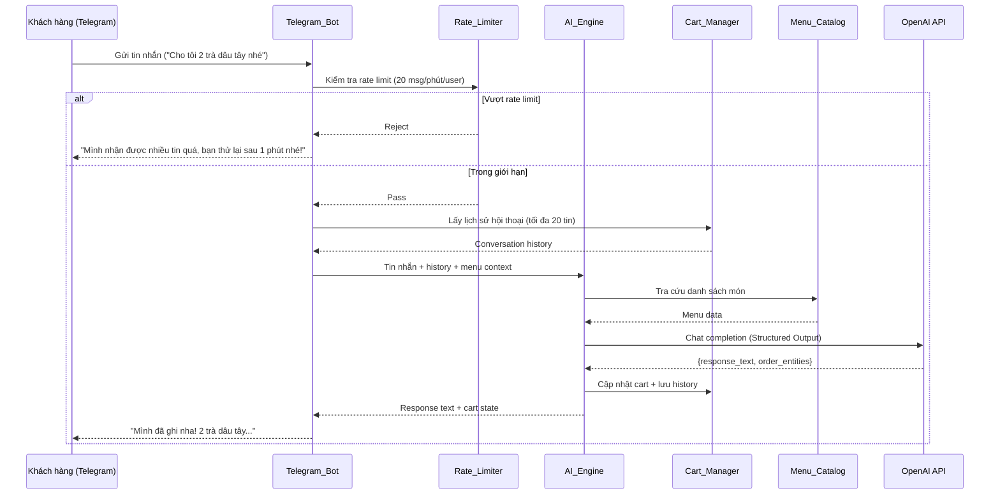
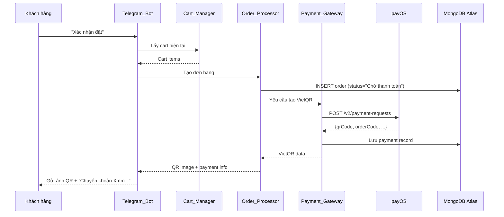
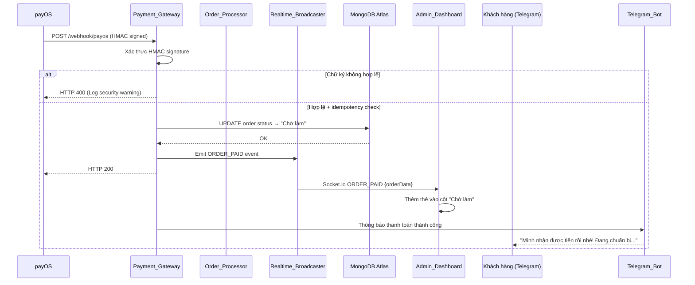
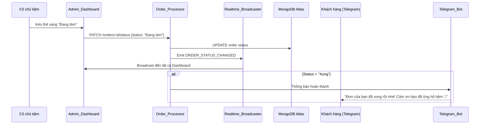

# Tài liệu Thiết kế: Hệ sinh thái Đặt hàng Toàn diện

## Tổng quan (Overview)

Hệ sinh thái Đặt hàng Toàn diện là một giải pháp end-to-end kết nối khách hàng đặt món qua Telegram Bot với cô chủ tiệm trà sữa thông qua Admin Dashboard Kanban theo thời gian thực. Hệ thống tự động hóa toàn bộ quy trình từ tiếp nhận đơn hàng, xử lý thanh toán đến thông báo kết quả.

### Vấn đề cốt lõi cần giải quyết

Nhận đơn thủ công qua tin nhắn gây ra các vấn đề: thông tin món dễ bị thiếu/nhầm, không theo dõi được trạng thái, thanh toán phải kiểm tra tay. Hệ thống này giải quyết bằng cách:

1. **AI đóng vai "Cô chủ tiệm"** — tư vấn tự nhiên và trích xuất entity đơn hàng chính xác từ hội thoại
2. **Thanh toán tự động** — payOS VietQR và webhook HMAC xác nhận giao dịch ngân hàng
3. **Dashboard thời gian thực** — Kanban Board cập nhật tức thì qua WebSockets

### Phạm vi hệ thống

- **Kênh tiếp nhận**: Telegram Bot (văn bản tự nhiên)
- **Xử lý nghiệp vụ**: Node.js/Express backend modular
- **Trí tuệ nhân tạo**: OpenAI gpt-4o-mini với Structured Outputs
- **Thanh toán**: payOS VietQR + Webhook HMAC
- **Lưu trữ**: MongoDB Atlas (persistent) + Upstash Redis (session/cache/rate-limit)
- **Thời gian thực**: Socket.io WebSockets
- **Giao diện quản lý**: React Admin Kanban Dashboard
- **Hạ tầng**: Koyeb, Prometheus + Grafana

---

## Kiến trúc (Architecture)

### Sơ đồ kiến trúc tổng thể



### Kiến trúc Modular Backend

Backend được tổ chức theo kiến trúc **modular monolith** — mỗi module có trách nhiệm độc lập, giao tiếp qua internal service interfaces. Bên trong mỗi module áp dụng mô hình **Controller - Service - Model (CSM)**:

- **Controller**: Nhận request HTTP/webhook, validate input, gọi Service, trả response. Không chứa business logic.
- **Service**: Chứa toàn bộ business logic, gọi Model để truy cập dữ liệu, gọi các Service khác khi cần.
- **Model**: Mongoose schema + các query helper. Không chứa business logic.

```
src/
├── modules/
│   ├── menu/
│   │   ├── menuCatalog.js      # Service — CSV loader, fuzzy match, hot-reload
│   │   └── menuCatalog.test.js
│   ├── bot/
│   │   ├── bot.controller.js   # Controller — nhận Telegram webhook, route intent
│   │   └── bot.service.js      # Service — sendMessage, sendPhoto, retry logic
│   ├── ai/
│   │   ├── ai.service.js       # Service — OpenAI Structured Outputs, persona
│   │   └── ai.service.test.js
│   ├── cart/
│   │   ├── cart.service.js     # Service — cart ops, history, rate limiting (Redis)
│   │   └── cart.service.test.js
│   ├── order/
│   │   ├── order.controller.js # Controller — REST API /api/orders
│   │   ├── order.service.js    # Service — tạo đơn, tính tiền, cập nhật trạng thái
│   │   ├── order.model.js      # Model — Mongoose schemas (Order, OrderItem, OrderStatusLog)
│   │   └── order.service.test.js
│   ├── payment/
│   │   ├── payment.controller.js # Controller — POST /webhook/payos
│   │   ├── payment.service.js    # Service — payOS SDK, HMAC verify, idempotency
│   │   ├── payment.model.js      # Model — Mongoose schema (Payment)
│   │   └── payment.service.test.js
│   └── realtime/
│       └── realtime.service.js   # Service — Socket.io emit, room management
├── shared/
│   ├── redis.js        # Upstash Redis client singleton
│   ├── db.js           # MongoDB Atlas connection
│   ├── logger.js       # Structured logging
│   └── metrics.js      # Prometheus metrics
└── app.js              # Express app bootstrap
```

**Quy tắc phụ thuộc giữa các lớp:**

```
HTTP Request
    ↓
Controller  →  validate input, gọi Service
    ↓
Service     →  business logic, gọi Model / Redis / external API
    ↓
Model       →  Mongoose query, trả dữ liệu thô
```

- Controller **không** import Model trực tiếp
- Model **không** import Service
- Service có thể gọi Service khác (ví dụ: `order.service` gọi `cart.service` và `realtime.service`)
- `menu/` không có Controller vì Menu_Catalog chỉ là internal service, không expose HTTP endpoint riêng
- `cart/` không có Controller vì Cart_Manager chỉ được gọi nội bộ từ `bot.controller` và `ai.service`
- `realtime/` không có Controller vì Socket.io không dùng HTTP request/response pattern

### Luồng xử lý chính

#### Luồng 1: Khách hàng đặt món



#### Luồng 2: Xác nhận đơn và thanh toán



#### Luồng 3: Xác thực webhook và cập nhật dashboard



#### Luồng 4: Người làm món cập nhật trạng thái



---

## Các Thành phần và Giao diện (Components and Interfaces)

### 1. Menu_Catalog

**Trách nhiệm**: Nguồn dữ liệu duy nhất về tên món và giá tiền.

**Internal API**:
```javascript
// MenuCatalog — module export
// getAllItems() → MenuItem[]
// findByName(name) → MenuItem | null   (fuzzy match, tolerance 2 chars)
// getPrice(itemName, size) → number    (size: 'M' | 'L', throws nếu không tìm thấy)
// reload() → Promise<void>             (hot-reload từ CSV)

// Cấu trúc MenuItem:
// {
//   item_id:     string,
//   name:        string,
//   price_m:     number,   // VND — giá size M
//   price_l:     number,   // VND — giá size L
//   description: string,
//   category:    string,
//   available:   boolean
// }
```

**CSV format**:
```csv
item_id,name,price_m,price_l,description,category,available
1,Trà dâu tây,32000,42000,"Trà tươi với vị dâu tây ngọt ngào",Trà Trái Cây,true
2,Trà Mâm Xôi,32000,42000,"Trà mâm xôi tươi mát giải khát",Trà Trái Cây,true
```

**Cơ chế hot-reload**: File watcher (chokidar) theo dõi thay đổi CSV, reload in-memory store mà không ảnh hưởng request đang xử lý (atomic swap).

---

### 2. Telegram_Bot

**Trách nhiệm**: Nhận webhook từ Telegram, định tuyến đến logic nghiệp vụ, gửi phản hồi.

**Express Routes**:
```
POST /webhook/telegram      — Nhận updates từ Telegram
POST /webhook/payos         — Nhận payment webhooks từ payOS
```

**Telegram Bot API methods sử dụng**:
- `sendMessage` — Gửi text response
- `sendPhoto` — Gửi ảnh QR code
- `sendMediaGroup` — (dự phòng)

**Retry logic**: Tối đa 3 lần, exponential backoff 1s → 2s → 4s.

---

### 3. AI_Engine

**Trách nhiệm**: Tư vấn persona "Cô chủ tiệm trà sữa" và trích xuất entity đơn hàng bằng OpenAI Structured Outputs.

**OpenAI Structured Output Schema** (JSON Schema dùng với `response_format`):
```javascript
// Schema truyền vào OpenAI response_format: { type: 'json_schema', json_schema: { ... } }
const aiResponseSchema = {
  name: 'ai_response',
  schema: {
    type: 'object',
    properties: {
      message:              { type: 'string' },                          // Phản hồi text hiển thị cho khách
      intent:               { type: 'string', enum: ['chat', 'order', 'view_cart', 'confirm_order', 'cancel'] },
      order_entities:       {
        type: 'array',
        items: {
          type: 'object',
          properties: {
            item_name:   { type: 'string' },                            // Tên món (sau fuzzy match với menu)
            quantity:    { type: 'number', minimum: 1 },                // Số lượng
            size:        { type: 'string', enum: ['M', 'L'] },         // Size — bắt buộc
            note:        { type: 'string' },                            // Ghi chú đặc biệt
            confidence:  { type: 'string', enum: ['high', 'medium', 'low'] }
          },
          required: ['item_name', 'quantity', 'size', 'note', 'confidence']
        }
      },
      clarification_needed: { type: 'boolean' },
      clarification_field:  { type: 'string', enum: ['item_name', 'quantity', 'size', 'note'] }
    },
    required: ['message', 'intent', 'order_entities', 'clarification_needed']
  }
};
```

**System Prompt cấu trúc**:
```
Bạn là cô chủ tiệm trà sữa thân thiện, ấm áp.
Menu hiện tại: {menuItems}  (mỗi món có giá M và giá L)
Nhiệm vụ:
1. Trả lời tự nhiên bằng ngôn ngữ khách dùng
2. Trích xuất entity đơn hàng chính xác, bao gồm size (M hoặc L)
3. Hỏi lại nếu không chắc về tên món, số lượng hoặc size
Quy tắc:
- Chỉ gợi ý món có trong menu
- Không tự tính giá
- Tối đa 3 gợi ý khi được hỏi
- Nếu khách không nói size, hỏi lại: "Bạn muốn size M hay L?"
```

**Fuzzy Matching**: Sử dụng Levenshtein distance (tolerance ≤ 2 ký tự) để khớp tên món.

---

### 4. Cart_Manager

**Trách nhiệm**: Quản lý giỏ hàng và lịch sử hội thoại trong Redis.

**Redis Key Schema**:
```
cart:{userId}              — Hash: giỏ hàng hiện tại
chat_history:{userId}      — List: lịch sử tin nhắn (tối đa 20)
rate_limit:{userId}:{minute} — String: counter rate limiting
```

**Internal API**:
```javascript
// CartManager — module export
// getCart(userId)                        → Promise<CartItem[]>
// addItem(userId, item)                  → Promise<void>
// updateItem(userId, itemName, quantity) → Promise<void>
// removeItem(userId, itemName)           → Promise<void>
// clearCart(userId)                      → Promise<void>
// getHistory(userId)                     → Promise<ChatMessage[]>
// appendHistory(userId, message)         → Promise<void>
// checkRateLimit(userId)                 → Promise<{ allowed: boolean, remaining: number }>

// Cấu trúc CartItem:
// {
//   itemName:  string,
//   quantity:  number,
//   size:      'M' | 'L',   // ảnh hưởng trực tiếp đến unitPrice
//   note:      string,
//   unitPrice: number        // từ menuCatalog.getPrice(itemName, size)
// }
```

**Atomic operations**: Sử dụng Redis Lua script hoặc MULTI/EXEC để đảm bảo tính nhất quán khi cập nhật cart, tránh race condition khi nhiều tin nhắn đến đồng thời.

**TTL Policy**:
- `cart:{userId}`: 24 giờ, reset mỗi khi có hoạt động
- `chat_history:{userId}`: 24 giờ, reset mỗi khi có hoạt động
- `rate_limit:{userId}:{minute}`: TTL 60 giây (sliding window)

---

### 5. Order_Processor

**Trách nhiệm**: Tạo đơn hàng, tính tiền từ Menu_Catalog, quản lý vòng đời đơn hàng.

**REST API**:
```
POST   /api/orders              — Tạo đơn hàng từ cart
GET    /api/orders              — Lấy danh sách đơn hàng active
GET    /api/orders/:id          — Lấy chi tiết đơn hàng
PATCH  /api/orders/:id/status   — Cập nhật trạng thái (dành cho Admin)
```

**Validation rules**:
- Tổng tiền phải > 0
- Tất cả item phải tồn tại trong Menu_Catalog
- Mỗi item phải có `size` hợp lệ (`'M'` hoặc `'L'`)
- `unitPrice` phải khớp với `Menu_Catalog.getPrice(itemName, size)` — không chấp nhận giá tự khai
- Cart không được rỗng

---

### 6. Payment_Gateway

**Trách nhiệm**: Tích hợp payOS API, xác thực HMAC webhook, đảm bảo idempotency.

**payOS Integration**:
- Sử dụng `@payos/node` SDK chính thức
- Tạo payment link với `orderCode` = order ID (unique)
- Webhook endpoint: `POST /webhook/payos`

**HMAC Verification**:
```javascript
const crypto = require('crypto');

// Xác thực signature từ payOS
function verifyWebhookSignature(payload, signature, secret) {
  const computed = crypto.createHmac('sha256', secret).update(payload).digest('hex');
  return crypto.timingSafeEqual(Buffer.from(computed), Buffer.from(signature));
}
```

**Idempotency**: Lưu `webhookEventId` vào MongoDB collection `payments` với unique index (`sparse: true`), reject duplicate events bằng cách kiểm tra trước khi xử lý.

---

### 7. Realtime_Broadcaster

**Trách nhiệm**: Phát sự kiện WebSockets đến Admin_Dashboard qua Socket.io.

**Socket.io Events**:
```javascript
// Server → Client events:
// 'ORDER_PAID'           — payload: orderData (object)
// 'ORDER_STATUS_CHANGED' — payload: { orderId, newStatus, order }
// 'CONNECTED'            — payload: { message }

// Client → Server events:
// 'SUBSCRIBE_ORDERS'     — không có payload
```

**Room management**: Tất cả Admin client join room `"admin-orders"`, broadcast chỉ đến room này.

---

### 8. Admin_Dashboard

**Trách nhiệm**: React SPA hiển thị Kanban Board, nhận sự kiện realtime, cho phép drag-and-drop cập nhật trạng thái.

**Component structure**:
```
App
├── ConnectionStatus          — Hiển thị trạng thái WebSocket
├── KanbanBoard
│   ├── KanbanColumn (Chờ làm)
│   │   └── OrderCard[]
│   ├── KanbanColumn (Đang làm)
│   │   └── OrderCard[]
│   └── KanbanColumn (Xong)
│       └── OrderCard[]
└── OrderCard
    ├── CustomerName
    ├── ItemList
    ├── TotalAmount
    └── OrderTime
```

**Reconnect Strategy**: Socket.io client tự động reconnect với interval 5 giây, hiển thị banner "Mất kết nối" khi offline.

**Thư viện drag-and-drop**: `@dnd-kit/core` — hỗ trợ accessibility tốt, không conflict với React 18.

---

## Mô hình Dữ liệu (Data Models)

### Mongoose Schemas (MongoDB Atlas)

```javascript
const mongoose = require('mongoose');
const { Schema } = mongoose;

// ─── Constants ───────────────────────────────────────────────────────────────

const ORDER_STATUS  = ['Chờ thanh toán', 'Chờ làm', 'Đang làm', 'Xong', 'Đã hủy'];
const PAYMENT_STATUS = ['pending', 'paid', 'cancelled', 'expired'];
const ITEM_SIZE     = ['M', 'L'];

// ─── OrderItem (embedded sub-document) ──────────────────────────────────────

const orderItemSchema = new Schema(
  {
    itemName:  { type: String, required: true },
    quantity:  { type: Number, required: true, min: 1 },
    size:      { type: String, enum: ITEM_SIZE, required: true },  // 'M' hoặc 'L'
    unitPrice: { type: Number, required: true, min: 1 },           // VND — snapshot giá tại thời điểm đặt
    note:      { type: String, default: '' },
  },
  { _id: false }  // items nhúng trực tiếp, không cần _id riêng
);

// ─── Order ───────────────────────────────────────────────────────────────────

const orderSchema = new Schema(
  {
    telegramUserId: { type: String, required: true },
    customerName:   { type: String, default: '' },
    status: {
      type:     String,
      enum:     ORDER_STATUS,
      default:  'Chờ thanh toán',
      required: true,
    },
    totalAmount: { type: Number, required: true, min: 1 },  // VND
    paymentCode: { type: String, default: null },
    items:       { type: [orderItemSchema], required: true },
    completedAt: { type: Date, default: null },
  },
  { timestamps: true }  // tự động quản lý createdAt + updatedAt
);

orderSchema.index({ status: 1 });
orderSchema.index({ telegramUserId: 1 });
orderSchema.index({ createdAt: -1 });

const Order = mongoose.model('Order', orderSchema);

// ─── Payment ─────────────────────────────────────────────────────────────────

const paymentSchema = new Schema(
  {
    orderId: {
      type:     Schema.Types.ObjectId,
      ref:      'Order',
      required: true,
    },
    payosOrderCode:     { type: Number, required: true, unique: true },
    payosPaymentLinkId: { type: String, default: '' },
    qrCode:             { type: String, default: '' },
    amount:             { type: Number, required: true },
    status: {
      type:    String,
      enum:    PAYMENT_STATUS,
      default: 'pending',
    },
    webhookEventId: { type: String, default: null, unique: true, sparse: true },  // idempotency key
    paidAt:         { type: Date, default: null },
  },
  { timestamps: true }
);

paymentSchema.index({ orderId: 1 });

const Payment = mongoose.model('Payment', paymentSchema);

// ─── OrderStatusLog ───────────────────────────────────────────────────────────

const orderStatusLogSchema = new Schema(
  {
    orderId: {
      type:     Schema.Types.ObjectId,
      ref:      'Order',
      required: true,
    },
    fromStatus: { type: String, enum: [...ORDER_STATUS, null], default: null },
    toStatus:   { type: String, enum: ORDER_STATUS, required: true },
    changedBy:  { type: String, required: true },  // 'system' | 'admin' | 'webhook'
  },
  { timestamps: { createdAt: true, updatedAt: false } }
);

orderStatusLogSchema.index({ orderId: 1 });

const OrderStatusLog = mongoose.model('OrderStatusLog', orderStatusLogSchema);

module.exports = { Order, Payment, OrderStatusLog, ORDER_STATUS, PAYMENT_STATUS, ITEM_SIZE };
```

### Upstash Redis Data Structures

> **Lưu ý**: Upstash Redis là dịch vụ serverless, tương thích hoàn toàn với `ioredis` — không cần thay đổi logic ứng dụng. Tính phí theo request, phù hợp với môi trường Koyeb không duy trì kết nối TCP liên tục.

```
# Giỏ hàng (Hash)
HSET cart:{userId} items (JSON serialized CartItem[])
EXPIRE cart:{userId} 86400

# Lịch sử hội thoại (List - LPUSH, LTRIM)
LPUSH chat_history:{userId} {JSON message}
LTRIM chat_history:{userId} 0 19   # Giữ 20 tin nhắn gần nhất
EXPIRE chat_history:{userId} 86400

# Rate limiting (String với INCR)
INCR rate_limit:{userId}:{minute_timestamp}
EXPIRE rate_limit:{userId}:{minute_timestamp} 60

# Idempotency cho webhook đã xử lý (Set)
SADD processed_webhooks {webhookEventId}
EXPIRE processed_webhooks:daily 86400
```

### API Request/Response Contracts

**POST /api/orders** — Tạo đơn hàng:
```javascript
// Request body
// { telegramUserId: string, customerName: string }

// Response 201
// {
//   orderId:     string,
//   totalAmount: number,
//   items:       OrderItemDetail[],
//   payment: {
//     qrCodeUrl:   string,
//     qrCodeImage: string,   // base64
//     orderCode:   string,
//     amount:      number,
//     description: string,   // Nội dung chuyển khoản
//     expiredAt:   string    // ISO8601
//   }
// }
```

**PATCH /api/orders/:id/status** — Cập nhật trạng thái:
```javascript
// Request body
// { status: 'Đang làm' | 'Xong' | 'Đã hủy', changedBy: string }

// Response 200
// { orderId: string, previousStatus: string, newStatus: string, updatedAt: string }
```

**GET /api/orders** — Lấy danh sách đơn active:
```javascript
// Query params: ?status=active&limit=50&offset=0

// Response 200
// {
//   orders: [
//     {
//       id:          string,
//       customerName: string,
//       status:      string,
//       items:       OrderItemDetail[],
//       totalAmount: number,
//       createdAt:   string,
//       paymentCode: string | undefined
//     }
//   ],
//   total: number
// }
```

**POST /webhook/payos** — Xử lý payment webhook:
```javascript
// Headers: x-payos-signature: <hmac-sha256>
// Body (từ payOS):
// {
//   code: string, desc: string, success: boolean,
//   data: {
//     orderCode: number, amount: number, description: string,
//     accountNumber: string, reference: string,
//     transactionDateTime: string, currency: string,
//     paymentLinkId: string, code: string, desc: string,
//     counterAccountBankId?: string, counterAccountBankName?: string,
//     counterAccountName?: string, counterAccountNumber?: string,
//     virtualAccountName?: string, virtualAccountNumber?: string
//   }
// }
```

---

## Xử lý Lỗi (Error Handling)

### Phân loại lỗi và chiến lược xử lý

| Lớp lỗi | Ví dụ | Chiến lược | Fallback |
|---------|-------|-----------|----------|
| Network timeout | OpenAI API timeout | Retry 3 lần, exponential backoff | Thông báo "tạm thời bận" |
| Redis unavailable | Upstash Redis connection refused | Circuit breaker, fail fast | Trả lỗi có cấu trúc đến Bot |
| MongoDB error | Connection timeout / write concern | Retry với timeout | Reject request, log alert |
| PayOS error | API rate limit / server error | Retry 3 lần | Giữ đơn hàng, thông báo retry |
| Invalid webhook | HMAC mismatch | Reject HTTP 400, log warning | N/A |
| OpenAI rate limit | 429 Too Many Requests | Exponential backoff, max 30s | Queue message, process later |
| CSV parse error | Malformed menu file | Fail startup với log chi tiết | N/A (hệ thống không khởi động) |

### Error Response Format

Tất cả lỗi từ API trả về format chuẩn:
```javascript
// { error: { code, message, userMessage?, details? } }
// Ví dụ:
// {
//   error: {
//     code:        'CART_EMPTY',
//     message:     'Cart is empty, cannot create order',
//     userMessage: 'Giỏ hàng trống, bạn hãy chọn món trước nhé!'
//   }
// }
```

### Circuit Breaker Pattern

AI_Engine và Payment_Gateway triển khai circuit breaker:
- **Closed state**: Xử lý bình thường
- **Open state**: Sau 5 lỗi liên tiếp trong 30s → reject ngay, fallback response
- **Half-open state**: Sau 60s → cho 1 request thử nghiệm

---

## Tính năng Giám sát (Monitoring)

### Prometheus Metrics

> **Lưu ý triển khai**: Prometheus metrics được export qua endpoint `/metrics` theo chuẩn `prom-client`. Trên Koyeb, endpoint này có thể được scrape trực tiếp bởi Prometheus self-hosted hoặc Grafana Cloud Agent. Không cần cấu hình thêm khi dùng Grafana Cloud.

```javascript
// Đơn hàng
// orders_total_counter          — Counter: tổng số đơn tạo
// orders_by_status_gauge        — Gauge: số đơn theo từng trạng thái
// order_processing_duration_ms  — Histogram: thời gian tạo đơn

// AI Engine
// ai_response_duration_ms       — Histogram: thời gian gọi OpenAI
// ai_calls_total                — Counter: tổng số lần gọi API
// ai_errors_total               — Counter: số lỗi OpenAI

// Thanh toán
// payments_total                — Counter: tổng số lần tạo payment
// payments_success_total        — Counter: số lần thanh toán thành công
// payment_webhook_duration_ms   — Histogram: thời gian xử lý webhook

// Hệ thống
// active_sessions_gauge         — Gauge: số session Redis đang active
// rate_limited_requests_total   — Counter: số request bị rate limit
```

### Health Check Endpoint

```
GET /health
Response: {
  status: "ok" | "degraded" | "down",
  components: {
    redis: "ok" | "error",
    mongodb: "ok" | "error",
    menu_catalog: "ok" | "error"
  }
}
```

---


---

## Hạ tầng Triển khai (Deployment)

| Thành phần | Dịch vụ | Ghi chú |
|-----------|---------|---------|
| Backend (Node.js/Express) | Koyeb | Deploy từ GitHub repo, auto-scale |
| Admin Dashboard (React) | Koyeb Static / Vercel | SPA build tĩnh |
| Cơ sở dữ liệu | MongoDB Atlas | Free tier M0, replica set |
| In-memory Cache | Upstash Redis | Serverless, tính phí theo request |
| Monitoring | Prometheus + Grafana Cloud | Scrape `/metrics` endpoint |
