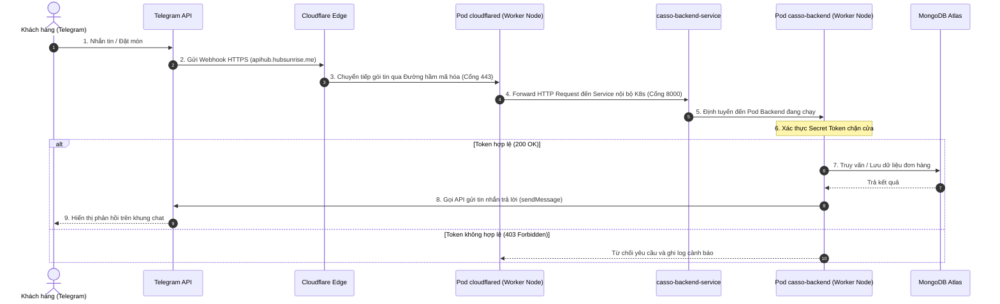
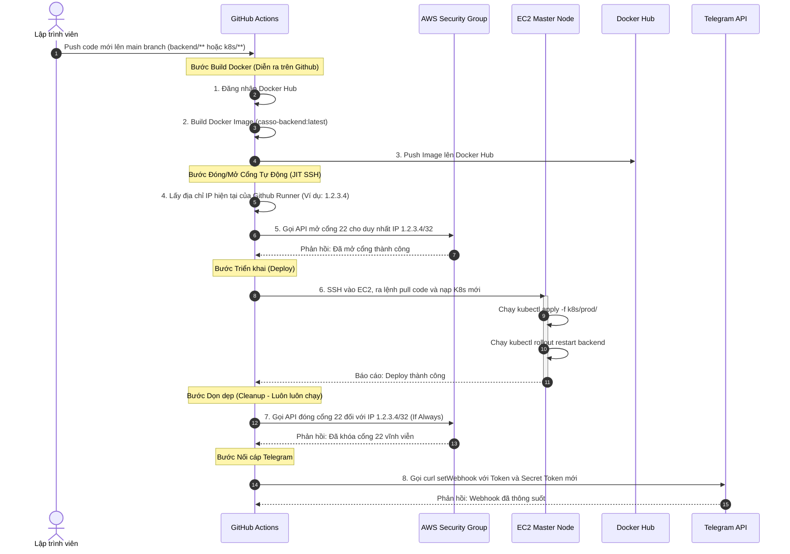

# Tài Liệu Kiến Trúc Hệ Thống SipSync K8s & Cloudflare

Tài liệu này mô tả chi tiết kiến trúc mạng và luồng dữ liệu của hệ thống SipSync, tập trung vào mô hình bảo mật **Zero Trust** sử dụng **Cloudflare Tunnel** tích hợp trong cụm **Kubernetes (K3s)** trên hạ tầng AWS EC2.

---

## 1. Tổng Quan Kiến Trúc (Architecture Overview)

Hệ thống SipSync được thiết kế theo nguyên tắc tối thiểu hóa bề mặt tấn công (Attack Surface Reduction). Điểm đặc biệt của kiến trúc này là **không mở bất kỳ cổng dịch vụ công khai nào (Port 80, 443) ra Internet**, giúp ẩn hoàn toàn địa chỉ IP của máy chủ AWS EC2.

---

## 2. Chi Tiết Các Thành Phần (Component Breakdown)

### 2.1. Lớp Cloudflare (Edge Network)
*   **Cloudflare DNS**: Quản lý tên miền `hubsunrise.me` và subdomain `apihub.hubsunrise.me` trỏ vào đường hầm bảo mật.
*   **Cloudflare Tunnel (`cloudflared`)**: Thiết lập một đường hầm mã hóa (outbound tunnel) từ bên trong cụm K8s đi ra mạng lưới Cloudflare qua cổng 443. Khi có yêu cầu gửi đến `apihub.hubsunrise.me`, Cloudflare sẽ dẫn luồng dữ liệu đi xuyên qua đường hầm này để tới thẳng Pod `cloudflared`.

### 2.2. Lớp Kubernetes (K3s Cluster trên AWS)
*   **Phân Tách Mối Quan Tâm (Node Selector)**: 
    *   **Master Node**: Chỉ chịu trách nhiệm điều phối cụm (`K3s Control Plane`), không chạy bất kỳ tải ứng dụng nào.
    *   **Worker Nodes (nhãn `role=worker`)**: Nơi tập trung chạy toàn bộ Pod của ứng dụng (`casso-backend`) và Pod kết nối (`cloudflared`).
*   **CoreDNS (K8s Service Discovery)**: Pod `cloudflared` sau khi nhận gói tin từ đường hầm sẽ chuyển tiếp trực tiếp tới `casso-backend-service:8000`. CoreDNS của K8s tự động phân giải tên Service này ra địa chỉ IP nội bộ của các Pod Backend đang hoạt động.
*   **ConfigMap & Secret**:
    *   `backend-config` (ConfigMap): Lưu trữ cấu hình môi trường không nhạy cảm (Port, Log Level, PayOS Client ID).
    *   `backend-secret` (Secret): Lưu trữ mật khẩu và mã khóa nhạy cảm (Mongo URI, Telegram Bot Token, OpenAI Key).

---

## 3. Luồng Đi Của Dữ Liệu (Traffic Flow)

### 3.1. Luồng Nhận Tin Nhắn (Inbound Webhook)
1. Khách hàng gửi tin nhắn vào Telegram Bot.
2. Máy chủ Telegram đẩy dữ liệu Webhook qua giao thức HTTPS về địa chỉ `https://apihub.hubsunrise.me/webhook/telegram`.
3. Cloudflare tiếp nhận yêu cầu, kiểm tra chứng chỉ HTTPS và đẩy gói tin qua **Cloudflare Tunnel** đi thẳng vào cụm K8s.
4. Pod `cloudflared` (chạy trên Worker) tiếp nhận gói tin, gọi tới Service `http://casso-backend-service:8000/webhook/telegram`.
5. Service phân phối gói tin đến Pod `casso-backend`.
6. Bộ kiểm soát bảo mật (`bot.controller.js`) kiểm tra tiêu đề `x-telegram-bot-api-secret-token` có khớp với `TELEGRAM_WEBHOOK_TOKEN` được cấu hình từ Secret hay không. Nếu khớp, tin nhắn được tiếp nhận xử lý.

### 3.2. Luồng Phản Hồi & Kết Nối Ngoại Vi (Outbound Traffic)
*   **Xử lý AI**: Backend chủ động gửi yêu cầu phân tích hội thoại lên `https://api.openai.com` (hoặc Groq).
*   **Gửi tin nhắn phản hồi**: Sau khi AI trả về kết quả, Backend gọi API của Telegram (`https://api.telegram.org/bot<TOKEN>/sendMessage`) để gửi câu trả lời về cho khách hàng.
*   **Thanh toán PayOS**: Khi khách hàng chốt đơn, Backend gọi lên API của PayOS để tạo link thanh toán VietQR và trả về ảnh QR cho khách hàng.

---

## 4. Các Biện Pháp Bảo Mật Đang Áp Dụng (Security Hardening)

1.  **Mô Hình Zero Ingress**: Không mở bất kỳ cổng nhận (inbound port) nào trên AWS Security Group cho cổng 80/443. Traffic đi vào hoàn toàn qua đường hầm hướng ra ngoài (outbound tunnel) của Cloudflare.
2.  **Xác Thực Chéo Webhook (Webhook Validation)**: Telegram Webhook sử dụng một chuỗi khóa bí mật `secret_token` được bắt tay giữa Telegram và Backend để chống lại các cuộc tấn công giả mạo request (Replay Attack).
3.  **Tách Biệt Môi Trường Nhạy Cảm**: Tuyệt đối không lưu trữ API Key hay Token trong file cấu hình (`config.yaml`). Tất cả được mã hóa và truyền an toàn qua K8s Secret.
4.  **Cách Ly Control Plane**: Sử dụng `nodeSelector: role: worker` để đảm bảo máy Master không bao giờ bị nghẽn tài nguyên do traffic hoặc do tiến trình build Docker của CI/CD.

---

## 5. Kiến Trúc Tự Động Hóa CI/CD (Just-In-Time SSH)

Để triển khai code lên cụm K3s một cách an toàn mà không cần mở cổng SSH 22 cho toàn thế giới 24/7, hệ thống ứng dụng kỹ thuật **Just-In-Time (JIT) Port Whitelisting** kết hợp với chính sách phân quyền tối thiểu (Least Privilege).

### 5.1. Sơ đồ tuần tự CI/CD (CI/CD Sequence Diagram)

### 5.2. Nguyên tắc Bảo mật trong CI/CD
*   **Offloaded Build (Build giảm tải):** Quá trình build Docker ngốn RAM/CPU lớn được thực hiện trên hạ tầng của GitHub. Máy chủ EC2 `t3.small` (2GB RAM) chỉ nhận ảnh chứa code đã được nén sẵn, loại bỏ hoàn toàn nguy cơ tràn RAM dẫn đến sập máy (OOM).
*   **Phân Quyền Tối Thiểu (Least Privilege):** Cặp mã khóa `AWS_ACCESS_KEY_ID` được lưu trên Github Secrets chỉ có quyền đóng/mở duy nhất một Security Group chỉ định. Kẻ xấu nếu đánh cắp được khóa cũng không thể xóa database hay tạo thêm máy ảo phá hoại.
*   **Khóa Cửa Tự Động (Cleanup Step):** Bước đóng cổng 22 được cấu hình `if: always()` trong GitHub Actions. Đảm bảo rằng dù quá trình deploy có bị crash, cổng 22 vẫn được khóa lại ngay lập tức.
