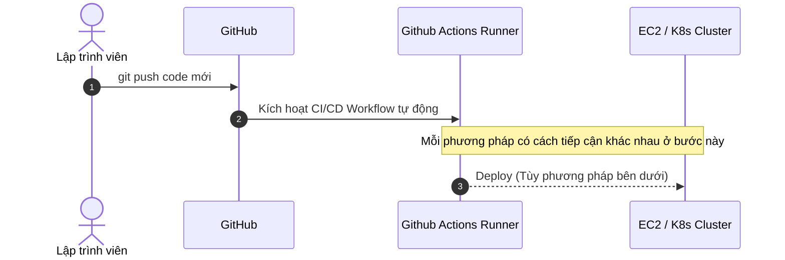
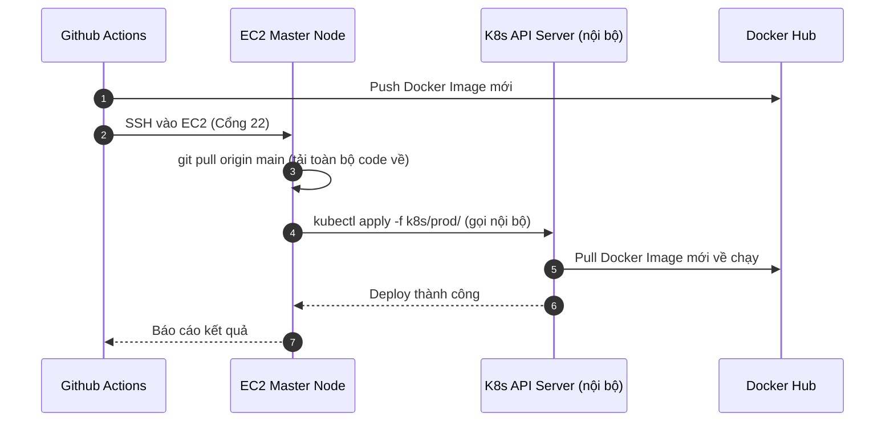
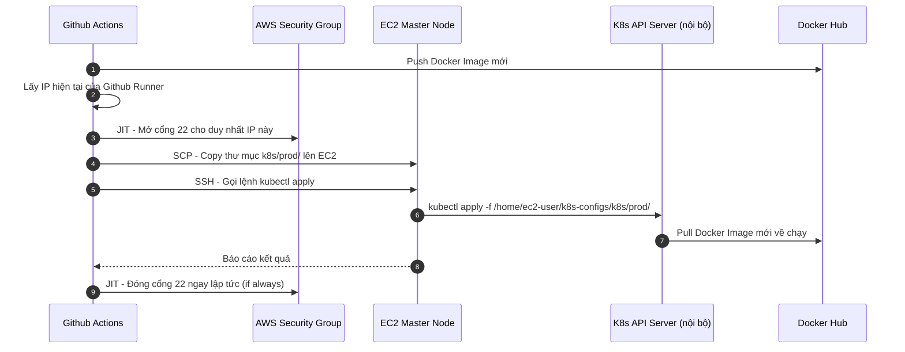
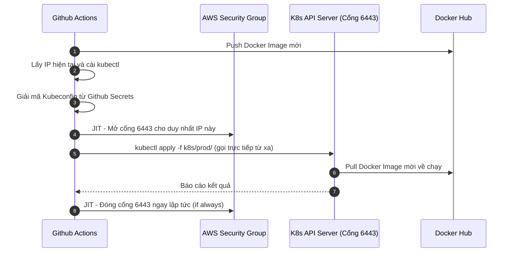
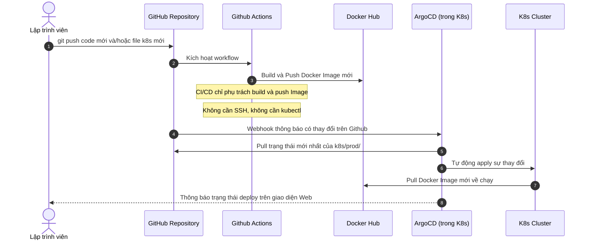
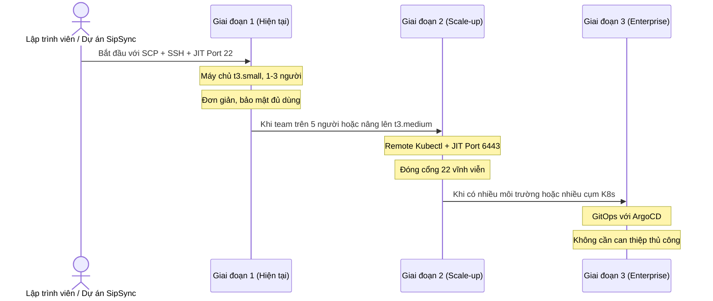

# Các Phương Pháp Tự Động Hóa Triển Khai Kubernetes (K8s CD Strategies)

Tài liệu này tổng hợp và so sánh các phương pháp phổ biến nhất để tự động hóa luồng cập nhật Kubernetes khi có thay đổi code mới, từ đơn giản nhất đến tiêu chuẩn doanh nghiệp.

---

## Tổng quan các phương pháp



---

## Phương pháp 1: SSH + Git Pull (Truyền thống)

### Cách hoạt động



```yaml
# Ví dụ cấu hình Github Actions:
- name: SSH Deploy
  uses: appleboy/ssh-action@master
  with:
    script: |
      cd /home/ec2-user/project
      git pull origin main
      kubectl apply -f k8s/prod/
```

### Ưu điểm
- Đơn giản, dễ hiểu, dễ debug.
- Không cần công cụ bổ sung phức tạp.
- Phù hợp cho người mới bắt đầu học DevOps.

### Nhược điểm
- EC2 phải cài Git (tốn ổ đĩa, tăng bề mặt tấn công).
- Toàn bộ mã nguồn nằm trên máy ảo Production (rủi ro bảo mật).
- Phải mở cổng SSH 22 cho Github Actions.
- EC2 phụ thuộc vào kết nối mạng Github khi deploy.

### Phù hợp với
- Dự án học tập, thử nghiệm.
- Đội ngũ nhỏ 1-2 người, chưa cần bảo mật cao.

---

## Phương pháp 2: SCP + SSH (Cải tiến - Đang dùng)

### Cách hoạt động



```yaml
# Ví dụ cấu hình Github Actions:
- name: SCP K8s configs
  uses: appleboy/scp-action@master
  with:
    source: "k8s/prod/"
    target: "/home/ec2-user/k8s-configs"

- name: SSH Apply
  uses: appleboy/ssh-action@master
  with:
    script: |
      export KUBECONFIG=~/.kube/config
      kubectl apply -f /home/ec2-user/k8s-configs/k8s/prod/
      kubectl rollout restart deployment casso-backend-deployment -n casso-prod
```

### Ưu điểm
- EC2 không cần cài Git, máy chủ sạch hơn.
- Chỉ truyền file cần thiết (YAML config), không truyền code nguồn.
- Tốc độ nhanh hơn (SCP chỉ copy vài KB file YAML).
- Kết hợp được với JIT SSH để đóng cổng 22 sau khi deploy.
- Không lưu code nguồn nhạy cảm trên EC2 Production.

### Nhược điểm
- Vẫn cần mở cổng SSH 22 thoáng qua (dù dùng JIT).
- Cần cài đặt file `~/.kube/config` trên EC2 trước (một lần duy nhất).
- Vẫn cần lưu Private SSH Key (`.pem`) trong Github Secrets.

### Phù hợp với
- Startup, dự án vừa như SipSync.
- Đội ngũ 2-10 người, cần bảo mật vừa phải, đơn giản vận hành.

---

## Phương pháp 3: Remote Kubectl + JIT Port 6443

### Cách hoạt động



```yaml
# Ví dụ cấu hình Github Actions:
- name: Install kubectl
  run: |
    curl -LO "https://dl.k8s.io/release/stable.txt"
    curl -LO "https://dl.k8s.io/release/$(cat stable.txt)/bin/linux/amd64/kubectl"
    chmod +x kubectl && sudo mv kubectl /usr/local/bin/

- name: JIT Open Port 6443
  run: |
    aws ec2 authorize-security-group-ingress \
      --group-id ${{ secrets.AWS_SG_ID }} \
      --protocol tcp --port 6443 \
      --cidr ${{ steps.get_ip.outputs.ipv4 }}/32

- name: Deploy K8s
  env:
    KUBECONFIG_DATA: ${{ secrets.KUBECONFIG_BASE64 }}
  run: |
    echo "$KUBECONFIG_DATA" | base64 -d > kubeconfig.yaml
    kubectl --kubeconfig kubeconfig.yaml apply -f k8s/prod/

- name: JIT Close Port 6443
  if: always()
  run: |
    aws ec2 revoke-security-group-ingress \
      --group-id ${{ secrets.AWS_SG_ID }} \
      --protocol tcp --port 6443 \
      --cidr ${{ steps.get_ip.outputs.ipv4 }}/32
```

### Ưu điểm
- EC2 hoàn toàn sạch, không cần SSH Key, không cần Git, không cần file cấu hình trên EC2.
- Đóng cổng SSH 22 vĩnh viễn, Hacker không thể SSH vào EC2.
- Không cần lưu SSH Private Key trong Github Secrets.

### Nhược điểm
- Cần lưu toàn bộ nội dung Kubeconfig trong Github Secrets. Nếu bị lộ, Hacker có quyền Admin K8s từ xa.
- Phải mở cổng 6443 thoáng qua, cổng API K8s là mục tiêu tấn công hàng đầu.
- Phức tạp hơn để cấu hình Kubeconfig đúng địa chỉ IP public.

### Phù hợp với
- Đội ngũ muốn đóng cổng SSH 22 hoàn toàn nhưng chưa muốn cài ArgoCD.

---

## Phương pháp 4: GitOps với ArgoCD / FluxCD (Tiêu chuẩn doanh nghiệp)

### Cách hoạt động



```yaml
# Github Actions chỉ cần build và push Docker Image:
- name: Build & Push Docker
  uses: docker/build-push-action@v5
  with:
    push: true
    tags: minhthu1704/casso-backend:latest

# ArgoCD tự phát hiện image mới và deploy - không cần thêm bước nào!
```

### Ưu điểm
- Không cần mở cổng 22 hay 6443 từ ngoài vào, đạt Zero Ingress tuyệt đối.
- Không lưu SSH Key hay Kubeconfig trong Github Secrets, bảo mật tối đa.
- Giao diện Web trực quan để xem trạng thái deploy của từng ứng dụng.
- Hỗ trợ Rollback một thao tác khi phát hiện lỗi sau deploy.
- Tự động phát hiện sai lệch cấu hình khi ai đó sửa K8s trực tiếp không qua Git.

### Nhược điểm
- Tốn khoảng 300MB RAM trên máy chủ (ArgoCD chạy nhiều component).
- Phức tạp hơn để cài đặt và cấu hình lần đầu.
- Quá mạnh so với nhu cầu, không cần thiết cho dự án 1-2 người.

### Phù hợp với
- Công ty vừa và lớn, team từ 5 người trở lên cùng deploy.
- Hệ thống có nhiều môi trường (dev/staging/prod).
- Cần nhật ký kiểm toán (ai deploy gì lúc mấy giờ).

---

## Bảng So Sánh Tổng Hợp

| Tiêu chí | SSH + Git Pull | SCP + SSH (Hiện tại) | Remote Kubectl + JIT | GitOps (ArgoCD) |
| :--- | :--- | :--- | :--- | :--- |
| **Độ phức tạp cấu hình** | Rất dễ | Vừa | Khó | Rất khó |
| **Bảo mật cổng mạng** | Yếu (22 mở) | Tốt (JIT 22) | Tốt (JIT 6443) | Tối đa |
| **Cần cài thêm trên EC2** | Git | Không | Không | ArgoCD |
| **Code nguồn trên EC2** | Có | Không | Không | Không |
| **Lưu SSH Key trong CI** | Có | Có | Không | Không |
| **RAM tiêu thụ EC2** | Nhẹ | Nhẹ | Nhẹ | Cộng 300MB |
| **Tốc độ deploy** | Chậm | Nhanh | Nhanh | Nhanh |
| **Phù hợp dự án nhỏ** | Có | Có | Có | Không |
| **Phù hợp doanh nghiệp** | Không | Trung bình | Trung bình | Có |

---

## Lộ trình nâng cấp được khuyến nghị



> [!TIP]
> Với cấu hình máy chủ `t3.small` (2GB RAM) hiện tại, phương pháp **SCP + SSH + JIT** là lựa chọn tối ưu nhất về chi phí, bảo mật và độ phức tạp vận hành. Chỉ nâng cấp lên ArgoCD khi sẵn sàng nâng cấp máy chủ lên ít nhất `t3.medium` (4GB RAM).
